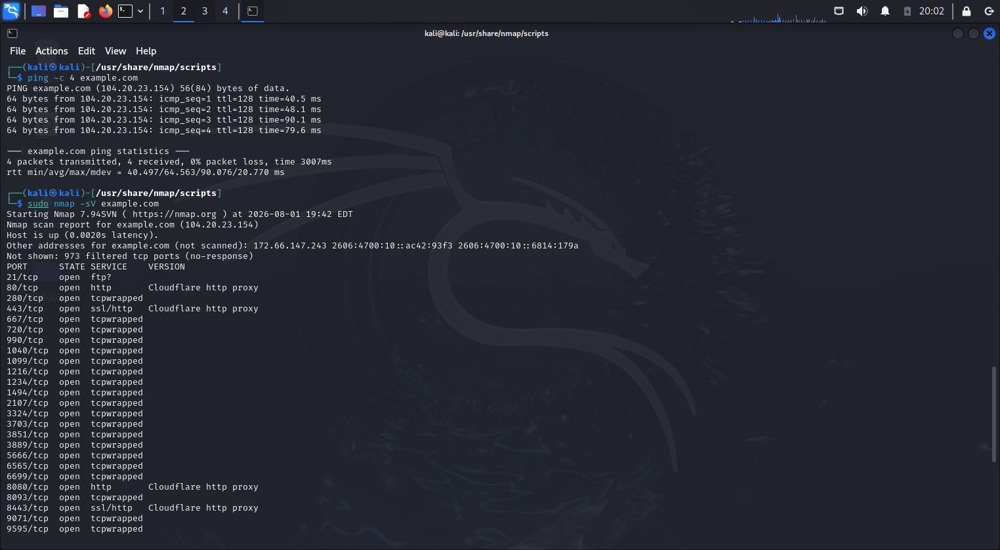

# Lab 01 – Ping Scan

## Objective
Determine whether the target host is online using Nmap.

## Command Used

```bash
ping -c 4 example.com
```

## Output



## Findings

- The target responded successfully.
- 0% packet loss was observed.
- The host is reachable.

## Skills Practiced

- Host discovery
- ICMP
- Basic network reconnaissance
