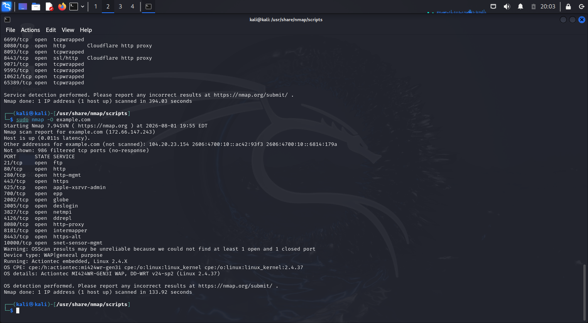

# Lab 03 – Operating System Detection

## Command Used

```bash
sudo nmap -O example.com
```

## Screenshot



## Findings

- Nmap attempted to identify the operating system.
- TTL and TCP/IP fingerprinting were used.

## Skills Practiced

- OS fingerprinting
- Reconnaissance
