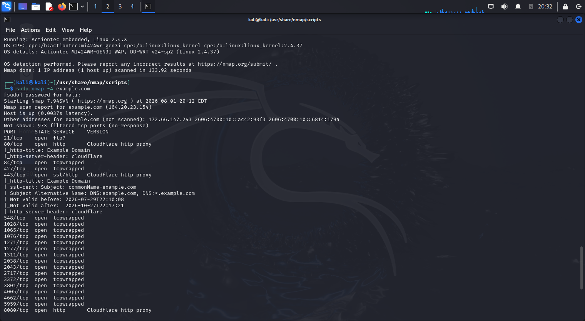

# Lab 04 – Aggressive Scan

## Command Used

```bash
sudo nmap -A example.com
```

## Screenshot



## Findings

- Detected services.
- Performed OS detection.
- Retrieved service banners.
- Executed default NSE scripts.
- Performed traceroute.

## Skills Practiced

- Enumeration
- Reconnaissance
- Service analysis
